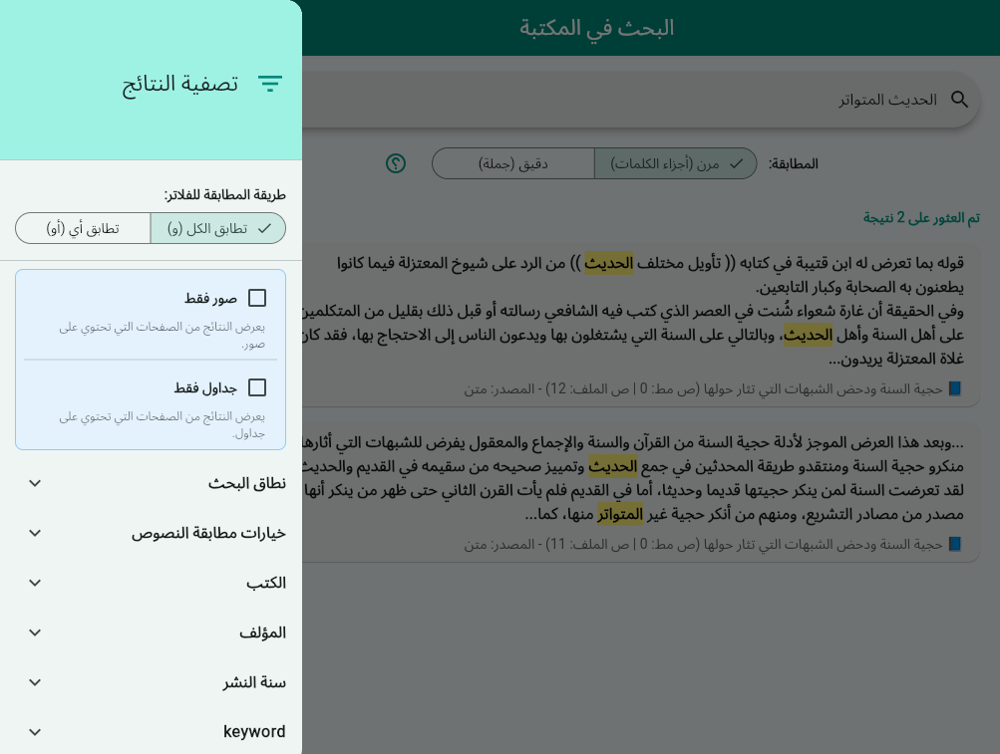
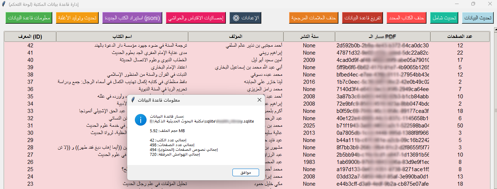
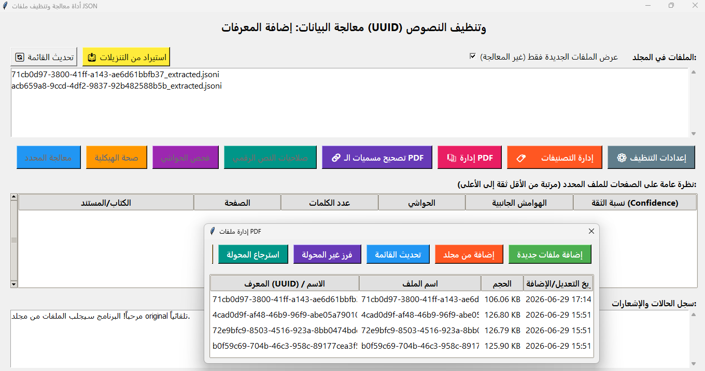
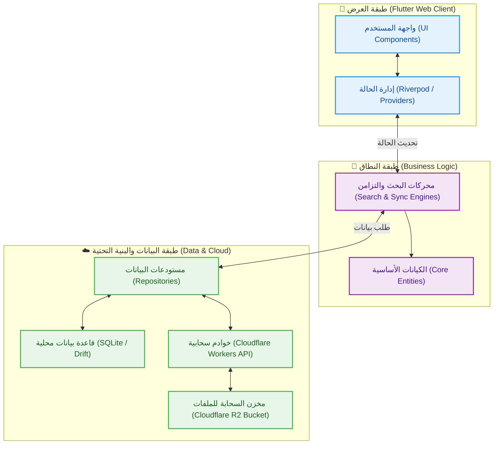

  <!-- [أدخل صورة البانر المتحرك أو الشعار هنا] -->
  

  # 🕌 مكتبة الأبحاث الحديثية الذكية (SaaS)
  
  **منصة أكاديمية سحابية متقدمة، تجمع بين المعرفة الشرعية العميقة والهندسة البرمجية المتطورة (Clean Architecture).**

  <!-- التقنيات المستخدمة -->
  

    
    
    
    
    
  

  [تجربة النسخة الحية](https://hadithresearchlibrary.pages.dev/)

---

## 📖 عن المشروع

**مكتبة الأبحاث الحديثية الذكية** هي منصة سحابية متكاملة (SaaS) صُممت بعناية لتخدم الباحثين الشرعيين، الأكاديميين، والمؤسسات العلمية، وتهدف إلى توفير بيئة بحث متقدمة تدمج بين دقة البحث النصي والمزامنة اللحظية مع المصورات الأصلية (PDF).

عادةً ما يتطلب البحث الحديثي التنقل بين آلاف الأبحاث العلمية والرسائل الاكاديمية، وهي عملية تستغرق وقتاً طويلاً وعرضة للخطأ. يحل هذا المشروع هذه المشكلة الجذرية من خلال رقمنة وهيكلة كميات ضخمة من الأبحاث الحديثية.

يعتمد المشروع على المعمارية النظيفة (Clean Architecture) لضمان قابلية التوسع والصيانة، مع فصل واضح بين واجهات المستخدم، وإدارة الحالة، والاتصال بقواعد البيانات (Local/Cloud).

## ✨ المميزات الرئيسية

*   🚀 **بحث نصي متقدم وفائق السرعة:** محرك بحث محلي وسحابي مصمم للتعامل مع النصوص العربية والوثائق الحديثية بدقة وسرعة.
    *   **
    *   **
*   🔄 **مزامنة لحظية للمخطوطات (pdfrx):** إمكانية الانتقال المباشر من النص المكتوب إلى الصفحة المطابقة في ملف PDF الأصلي، لتوثيق المعلومات فورياً.
    *   **
*   📶 **دعم العمل دون اتصال (Offline Support):** بفضل معمارية التطبيق متعددة المنصات والتخزين المحلي الفعال عبر (Drift/SQLite)، تتيح نسخة سطح المكتب (Desktop) للمستخدم الوصول إلى المكتبة وإجراء عمليات البحث المتقدمة محلياً دون أي حاجة للاتصال بالإنترنت، بينما صُممت نسخة الويب للعمل السحابي المرن.
*   📱 **تصميم متجاوب ومتعدد المنصات:** تجربة مستخدم موحدة وسلسة عبر الويب، سطح المكتب، والهواتف المحمولة، اعتماداً على قوة إطار عمل Flutter.
    *   **
*   ⚙️ **أتمتة معالجة البيانات (Data Ingestion Pipeline):** تم بناء أداة مساعدة بلغة (Python) تقوم آلياً بقراءة ومعالجة مئات الأبحاث والكتب المحفوظة بصيغة (`.jsoni`) المنفصلة، ثم تقوم بفلترتها وتوحيدها وحقنها داخل قاعدة بيانات (SQLite) مركزية ومهيأة للبحث السريع (FTS5). هذه الأداة تفصل بين "إدارة المحتوى" و"كود التطبيق"، مما يتيح توسعة المكتبة وإضافة آلاف الأبحاث الجديدة بضغطة زر دون الحاجة لتعديل أو تحديث كود التطبيق الأساسي.
    *   **

## 🛠️ أدوات الإدارة والخلفية (SmartReaderPro)

> **ملاحظة:** تتم عملية تحويل مصورات الأبحاث (PDF) وهيكلتها، وتنظيمها، وإدارتها، وتنقيحها، وتنسيقها من خلال أدوات خلفية متطورة مخصصة لإدارة المكتبة.

**

مشروع **SmartReaderPro** هو عبارة عن أداة متطورة قمت بتصميمها لتحليل واستخراج النصوص والبيانات الأكاديمية المعقدة من المستندات (مثل الصور وملفات PDF). يقوم المشروع بتحويل محتوى الصفحات إلى هيكل بيانات منظم ودقيق جداً (بصيغة مخصصة تُسمى `.jsoni`)، مع استخراج وفصل عناصر دقيقة كالحواشي السفلية، الفهارس، التوصيف الدلالي (Semantic Tags)، وتحديد بنية الأبحاث الأكاديمية كالدراسات السابقة والمستخلص ومنهج البحث والنتائج والتوصيات...

**أهم التقنيات المستخدمة في المشروع:**

*   **الواجهة الأمامية (Frontend):**
    *   **React (بصيغة TSX):** تم بناء التطبيق الأساسي كواجهة تفاعلية باستخدام React، حيث يدير حالات التطبيق المعقدة وعمليات المعالجة المتزامنة.
    *   **Tailwind CSS:** لتصميم واجهة عصرية وسريعة الاستجابة تدعم الوضعين الفاتح والداكن.
    *   **مكتبات إضافية:** `lucide-react` للأيقونات، و `react-hot-toast` لعرض الإشعارات والتنبيهات.

*   **تكامل الذكاء الاصطناعي (AI Integration):**
    *   يعتمد المشروع بشكل أساسي على نماذج ذكية متقدمة مثل **Gemini 1.5 Pro** و **Gemini 2.5 Flash** وغيرها لاستخلاص بيانات معقدة تقوم باستخراج النصوص، الإحداثيات (Bounding Boxes)، تحليل حالة الصفحة، وفهم السياق الأكاديمي.

*   **الأدوات المساعدة والخلفية (Backend Utilities):**
    *   **Python:** تم استخدام بايثون لبناء مجموعة كبيرة من السكربتات المساندة (موجودة في مجلد `jsoni_treater`).
    *   **Tkinter:** تُستخدم لإنشاء واجهات رسومية (GUI) لأدوات سطح المكتب الجانبية مثل (إدارة التصنيفات `category_manager`، وتصحيح الحواشي `footnote_fixer`، وإدارة ملفات PDF).

*   **هيكلة البيانات:**
    *   **امتداد .jsoni:** هو هيكلية خصصتها للمشروع وهو العصب الأساسي للبيانات في هذا المشروع، حيث تُحفظ جميع المخرجات (نصوص، إحداثيات، بيانات وصفية للكتب، وعناصر الأبحاث) داخل ملفات مهيكلة بدقة شديدة لتسهيل مراجعتها وتصنيفها لاحقاً .

## 🏗️ الهيكلية البرمجية (Technical Architecture)

يعتمد المشروع على **المعمارية النظيفة (Clean Architecture)** لضمان أقصى درجات المرونة، وقابلية التوسع والصيانة، مع تطبيق مبادئ (SOLID) واستخدام أنماط التصميم مثل (Repository Pattern). يوضح المخطط التالي دورة تدفق البيانات وتفاعل المكونات:

### التقنيات المستخدمة:
*   **تطوير واجهات المستخدم (Flutter & Dart):** لبناء واجهات مستخدم سلسة وعالية الأداء تعمل على مختلف أنظمة التشغيل من كود برمجي واحد.
*   **إدارة الحالة (Riverpod):** لإدارة حالة التطبيق بشكل تفاعلي وآمن.
*   **قواعد البيانات (Drift / SQLite):** لبناء قاعدة بيانات محلية قوية تدعم التخزين المؤقت والبحث السريع (Offline-first).
*   **الخوادم السحابية:** تم استخدام **Python & FastAPI** و **Cloudflare Workers API** لمعالجة البيانات الكثيفة وسرعة الاستجابة، بالإضافة إلى **Cloudflare R2 Bucket** لتخزين الملفات السحابية كبديل لـ AWS S3.
*   **التعامل مع المستندات:** مكتبة **pdfrx** لعرض ومعالجة ملفات PDF بمزامنة دقيقة.
*   **معالجة النصوص المتقدمة (Regex):** استخدام التعابير النمطية (Regular Expressions) لفلترة النصوص العربية، وتوحيد الهمزات والتشكيل والاختلافات الإملائية، مما يضمن دقة ومرونة عالية جداً في مطابقة نتائج البحث.

## 🔒 ملاحظة حول الكود المصدري (مستودع عرض فقط)

> **ملاحظة:**
> هذا المستودع مخصص كـ **واجهة عرض (Showcase)** لتوضيح المعمارية التقنية، وتصميم واجهات المستخدم (UI/UX)، والمميزات البرمجية للمشروع.
> 
> نظراً لحقوق الملكية الفكرية (IP)، فإن الكود المصدري الفعلي محفوظ في **مستودع مغلق (Private)**. ويسعدني جداً مناقشة تفاصيل التنفيذ البرمجي، تصميم النظام، وأفضل الممارسات المتبعة في كتابة الكود.
> 
> 🔗 **[اضغط هنا لتجربة النسخة الحية](https://hadithresearchlibrary.pages.dev/)**

## 📫 التواصل

أرحب دائماً بمناقشة الفرص الوظيفية التقنية، التعاون الأكاديمي، أو الفرص الاستثمارية.

*   💼 **لينكد إن:** [حسابي على لينكد إن](https://www.linkedin.com/in/imadeddinbtli/)

