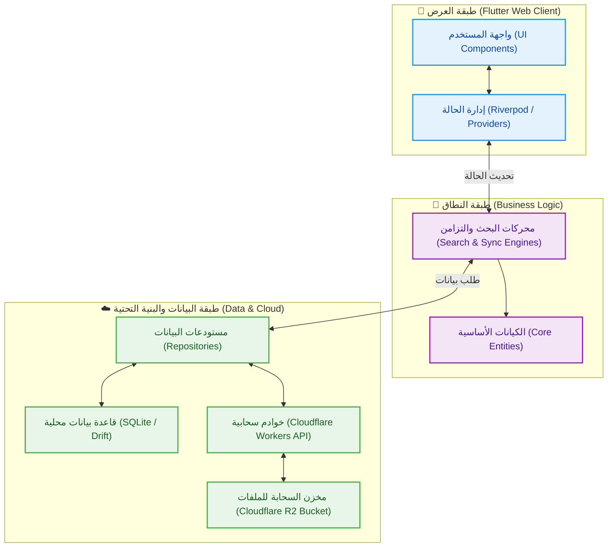
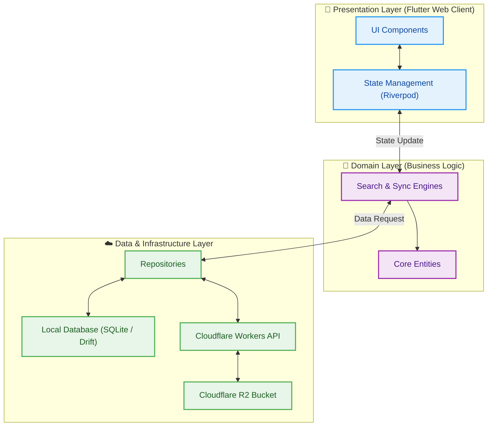

[English Version Below ⬇️](#english-version)

  <!-- [أدخل صورة البانر المتحرك أو الشعار هنا] -->
  

  # 🕌 مكتبة الأبحاث الحديثية الذكية (SaaS)
  
  **منصة أكاديمية سحابية متقدمة، تجمع بين المعرفة الشرعية العميقة والهندسة البرمجية المتطورة (Clean Architecture).**

  <!-- التقنيات المستخدمة -->
  

    
    
    
    
    
  

  [تجربة النسخة الحية](https://hadithresearchlibrary.pages.dev/)

---

## 📖 عن المشروع

**مكتبة الأبحاث الحديثية الذكية** هي منصة سحابية متكاملة (SaaS) صُممت بعناية فائقة لتخدم الباحثين الشرعيين، الأكاديميين، والمؤسسات العلمية، وتهدف إلى توفير بيئة بحث متقدمة تدمج بين دقة البحث النصي والمزامنة اللحظية مع المصورات الأصلية (PDF).

عادةً ما يتطلب البحث الحديثي التنقل بين آلاف المخطوطات والكتب المطبوعة، وهي عملية تستغرق وقتاً طويلاً وعرضة للخطأ. يحل هذا المشروع هذه المشكلة الجذرية من خلال رقمنة وهيكلة كميات ضخمة من الأبحاث الحديثية.

يعتمد المشروع على المعمارية النظيفة (Clean Architecture) لضمان قابلية التوسع والصيانة، مع فصل واضح بين واجهات المستخدم، وإدارة الحالة، والاتصال بقواعد البيانات (Local/Cloud).

## ✨ المميزات الرئيسية

*   🚀 **بحث نصي متقدم وفائق السرعة:** محرك بحث محلي وسحابي مصمم للتعامل مع النصوص العربية والوثائق الحديثية بدقة وسرعة.
    *   **
*   🔄 **مزامنة لحظية للمخطوطات (pdfrx):** إمكانية الانتقال المباشر من النص المكتوب إلى الصفحة المطابقة في ملف PDF الأصلي، لتوثيق المعلومات فورياً.
    *   **
*   📶 **دعم العمل دون اتصال (Offline Support):** بفضل التخزين المحلي الفعال عبر (Drift/SQLite)، يمكن للمستخدم الوصول إلى أجزاء واسعة من المكتبة وإجراء عمليات البحث دون الحاجة الدائمة للإنترنت.
*   📱 **تصميم متجاوب ومتعدد المنصات:** تجربة مستخدم موحدة وسلسة عبر الويب، سطح المكتب، والهواتف المحمولة، اعتماداً على قوة إطار عمل Flutter.
    *   **

## 🏗️ الهيكلية البرمجية (Technical Architecture)

يعتمد المشروع على **المعمارية النظيفة (Clean Architecture)** لضمان أقصى درجات المرونة، وقابلية التوسع والصيانة، مع تطبيق مبادئ (SOLID) واستخدام أنماط التصميم مثل (Repository Pattern). يوضح المخطط التالي دورة تدفق البيانات وتفاعل المكونات:

### التقنيات المستخدمة بتفصيل:
*   **تطوير واجهات المستخدم (Flutter & Dart):** لبناء واجهات مستخدم سلسة وعالية الأداء تعمل على مختلف أنظمة التشغيل من كود برمجي واحد.
*   **إدارة الحالة (Riverpod):** لإدارة حالة التطبيق بشكل تفاعلي وآمن.
*   **قواعد البيانات (Drift / SQLite):** لبناء قاعدة بيانات محلية قوية تدعم التخزين المؤقت والبحث السريع (Offline-first).
*   **الخوادم السحابية:** تم استخدام **Python & FastAPI** و **Cloudflare Workers API** لمعالجة البيانات الكثيفة وسرعة الاستجابة، بالإضافة إلى **Cloudflare R2 Bucket** لتخزين الملفات السحابية كبديل لـ AWS S3.
*   **التعامل مع المستندات:** مكتبة **pdfrx** لعرض ومعالجة ملفات PDF بمزامنة دقيقة.

## 🔒 ملاحظة حول الكود المصدري (مستودع عرض فقط)

> **ملاحظة لمدراء التوظيف والمدراء التقنيين (CTOs):**
> هذا المستودع مخصص كـ **واجهة عرض (Showcase)** لتوضيح المعمارية التقنية، تصميم واجهات المستخدم (UI/UX)، والمميزات البرمجية للمشروع.
> 
> نظراً لحقوق الملكية الفكرية (IP) والتراخيص التجارية، فإن الكود المصدري الفعلي محفوظ في **مستودع مغلق (Private)**. يسعدني جداً مناقشة تفاصيل التنفيذ البرمجي، تصميم النظام، وأفضل الممارسات المتبعة في كتابة الكود خلال المقابلات التقنية.
> 
> 🔗 **[اضغط هنا لتجربة النسخة الحية](https://hadithresearchlibrary.pages.dev/)**

## 📫 التواصل

أرحب دائماً بمناقشة الفرص الوظيفية التقنية، التعاون الأكاديمي، أو الفرص الاستثمارية.

*   💼 **لينكد إن:** [أدخل رابط حساب لينكد إن هنا]
*   📧 **البريد الإلكتروني:** [أدخل البريد الإلكتروني هنا]

---
 

<h1 id="english-version" align="left">English Version</h1>

  <!-- [Placeholder for Animated Banner or Logo] -->
  

  # 🕌 Smart Hadith Research Library (SaaS)
  
  **An Advanced Cloud-Based Academic Platform Bridging Deep Islamic Sciences with State-of-the-Art Software Engineering (Clean Architecture).**

  <!-- Badges -->
  

    
    
    
    
    
  

  [Live Demo](https://hadithresearchlibrary.pages.dev/)

---

## 📖 About The Project

The **Smart Hadith Research Library** is a comprehensive SaaS platform meticulously engineered to serve Islamic scholars, researchers, and academic institutions. 

Traditional Hadith research often involves navigating through thousands of structured manuscripts and text volumes—a time-consuming and error-prone process. This project solves this fundamental problem by digitizing and structuring massive volumes of Hadith research, pairing it with lightning-fast text search capabilities, and instantly synchronizing search results with high-resolution scans of the original manuscripts (PDFs).

The project is built on **Clean Architecture** principles to ensure high scalability and maintainability, with a clear separation of concerns between the UI, state management, and data layers (Local/Cloud).

## ✨ Key Features

*   🚀 **Ultra-Fast Advanced Text Search:** Local and cloud-based search engines optimized for accurate and rapid querying of Arabic text and structured Hadith documents.
    *   **
*   🔄 **Real-Time Manuscript Synchronization (pdfrx):** Side-by-side view where navigating the digital text instantly syncs with the exact location in the original scanned PDF manuscript or book.
    *   **
*   📶 **Offline Support (Offline-First):** Thanks to efficient local caching with Drift (SQLite), users can access large parts of the library and perform complex searches without a constant internet connection.
*   📱 **Cross-Platform Accessibility:** A seamless, responsive experience across Web, Desktop, and Mobile, leveraging Flutter's unified codebase.
    *   **

## 🏗️ Technical Architecture

This platform utilizes **Clean Architecture** to ensure maximum flexibility, scalability, and maintainability. The codebase heavily relies on SOLID principles and the Repository Pattern. The diagram below illustrates the data flow and component interaction:

### Technology Stack Details:
*   **Frontend (Flutter & Dart):** Chosen for its unparalleled ability to deliver native-like performance and highly customized, interactive UI components across all platforms from a single codebase.
*   **State Management (Riverpod):** Used for robust and reactive state management across the application.
*   **Local Database (Drift / SQLite):** Implementing an offline-first approach with robust caching and local search capabilities.
*   **Backend & Cloud:** **Python & FastAPI** alongside **Cloudflare Workers API** for fast, asynchronous data processing, and **Cloudflare R2 Bucket** for efficient object storage.
*   **Document Handling:** The **pdfrx** library is used to seamlessly render and sync PDF files.

## 🔒 Source Code Notice (Showcase Repository)

> **Note to Recruiters and Engineering Managers:**
> This repository serves as a **Showcase / Presentation** of the project's architecture, UI/UX, and technical capabilities. 
> 
> Due to Intellectual Property (IP) protection and commercial licensing, the actual source code resides in a **private repository**. I am more than happy to discuss the technical implementation details, system design, and coding practices during an interview.
> 
> 🔗 **[Click here to try the Live Demo](https://hadithresearchlibrary.pages.dev/)**

## 📫 Contact & Connect

I am actively open to discussions regarding technical roles, collaborations, or investment opportunities.

*   💼 **LinkedIn:** [Insert LinkedIn Profile URL Here]
*   📧 **Email:** [Insert Email Address Here]

