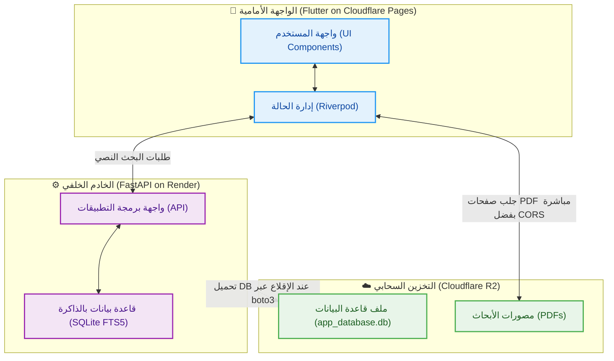

  <!-- [أدخل صورة البانر المتحرك أو الشعار هنا] -->
  

  # &rlm;🕌 مكتبة الأبحاث الحديثية الذكية (SaaS)
  
  **منصة أكاديمية سحابية متقدمة، تجمع بين المعرفة الشرعية العميقة والهندسة البرمجية المتطورة (Clean Architecture).**

  <!-- التقنيات المستخدمة -->
  

    
    
    
    
    
    
  

  [تجربة النسخة الحية](https://hadithresearchlibrary.pages.dev/)

---

## &rlm;📖 عن المشروع

**مكتبة الأبحاث الحديثية الذكية** هي منصة سحابية متكاملة (SaaS) صُممت بعناية لتخدم الباحثين الشرعيين، الأكاديميين، والمؤسسات العلمية، وتهدف إلى توفير بيئة بحث متقدمة تدمج بين دقة البحث النصي والمزامنة اللحظية مع المصورات الأصلية (PDF).

عادةً ما يتطلب البحث الحديثي التنقل بين آلاف الأبحاث العلمية والرسائل الاكاديمية، وهي عملية تستغرق وقتاً طويلاً وعرضة للخطأ خصوصا ومعظم هذه الأبحاث عبارة عن مصورات وغير مهيكلة. يحل هذا المشروع هذه المشكلة الجذرية من خلال رقمنة وهيكلة كميات ضخمة من الأبحاث الحديثية، مما يسرع عملية البحث بدقة عالية ويساعد في تحديد الفجوات المعرفية.

يعتمد المشروع على المعمارية النظيفة (Clean Architecture) لضمان قابلية التوسع والصيانة، مع فصل واضح بين واجهات المستخدم، وإدارة الحالة، والاتصال بقواعد البيانات (Local/Cloud).

## &rlm;✨ المميزات الرئيسية

* &rlm;🚀 **بحث نصي متقدم وفائق السرعة:** محرك بحث محلي وسحابي مصمم للتعامل مع النصوص العربية والوثائق الحديثية بدقة وسرعة.
    * &rlm;**
    * &rlm;**
* &rlm;🔄 **مزامنة لحظية للمخطوطات (pdfrx):** إمكانية الانتقال المباشر من النص المكتوب إلى الصفحة المطابقة في ملف PDF الأصلي، لتوثيق المعلومات فورياً.
    * &rlm;**
* &rlm;📶 **دعم العمل دون اتصال (Offline Support):** بفضل معمارية التطبيق متعددة المنصات والتخزين المحلي الفعال عبر (Drift/SQLite)، تتيح نسخة سطح المكتب (Desktop) للمستخدم الوصول إلى المكتبة وإجراء عمليات البحث المتقدمة محلياً دون أي حاجة للاتصال بالإنترنت، بينما صُممت نسخة الويب للعمل السحابي المرن.
* &rlm;📱 **تصميم متجاوب ومتعدد المنصات:** تجربة مستخدم موحدة وسلسة عبر الويب، سطح المكتب، والهواتف المحمولة، اعتماداً على قوة إطار عمل Flutter.
    * &rlm;**
* &rlm;⚙️ **أتمتة معالجة البيانات (Data Ingestion Pipeline):** تم بناء أداة مساعدة بلغة (Python) تقوم آلياً بقراءة ومعالجة مئات الأبحاث والكتب المحفوظة بصيغة (`.jsoni`) المنفصلة، ثم تقوم بفلترتها وتوحيدها وحقنها داخل قاعدة بيانات (SQLite) مركزية ومهيأة للبحث السريع (FTS5). هذه الأداة تفصل بين "إدارة المحتوى" و"كود التطبيق"، مما يتيح توسعة المكتبة وإضافة آلاف الأبحاث الجديدة بضغطة زر دون الحاجة لتعديل أو تحديث كود التطبيق الأساسي.
    * &rlm;**

## &rlm;🛠️ أدوات الإدارة والخلفية (SmartReaderPro)

> **ملاحظة:** تتم عملية تحويل مصورات الأبحاث (PDF) وهيكلتها، وتنظيمها، وإدارتها، وتنقيحها، وتنسيقها من خلال أدوات خلفية متطورة مخصصة لإدارة المكتبة.

**

مشروع **SmartReaderPro** هو عبارة عن أداة متطورة قمت بتصميمها لتحليل واستخراج النصوص والبيانات الأكاديمية المعقدة من المستندات (مثل الصور وملفات PDF). يقوم المشروع بتحويل محتوى الصفحات إلى هيكل بيانات منظم ودقيق جداً (بصيغة مخصصة سميتها `.jsoni`)، مع استخراج وفصل عناصر دقيقة كالحواشي السفلية، الفهارس، التوصيف الدلالي (Semantic Tags)، وتحديد بنية الأبحاث الأكاديمية كالدراسات السابقة والمستخلص ومنهج البحث والنتائج والتوصيات...

**أهم التقنيات المستخدمة في المشروع:**

* &rlm;**الواجهة الأمامية (Frontend):**
    * &rlm;**React (بصيغة TSX):** تم بناء التطبيق الأساسي كواجهة تفاعلية باستخدام React، حيث يدير حالات التطبيق المعقدة وعمليات المعالجة المتزامنة.
    * &rlm;**Tailwind CSS:** لتصميم واجهة عصرية وسريعة الاستجابة تدعم الوضعين الفاتح والداكن.
    * &rlm;**مكتبات إضافية:** `lucide-react` للأيقونات، و `react-hot-toast` لعرض الإشعارات والتنبيهات.

* &rlm;**تكامل الذكاء الاصطناعي (AI Integration):**
    * &rlm;يعتمد المشروع على نماذج ذكية متقدمة مثل **Gemini 1.5 Pro** و **Gemini 2.5 Flash** وغيرها لاستخلاص بيانات معقدة تقوم باستخراج النصوص، الإحداثيات (Bounding Boxes)، تحليل حالة الصفحة، وفهم السياق الأكاديمي.

* &rlm;**الأدوات المساعدة والخلفية (Backend Utilities):**
    * &rlm;**Python:** تم استخدام بايثون لبناء مجموعة كبيرة من السكربتات المساندة (موجودة في مجلد `jsoni_treater`).
    * &rlm;**Tkinter:** تُستخدم لإنشاء واجهات رسومية (GUI) لأدوات سطح المكتب الجانبية مثل (إدارة التصنيفات `category_manager`، وتصحيح الحواشي `footnote_fixer`، وإدارة ملفات PDF).

* &rlm;**هيكلة البيانات:**
    * &rlm;**امتداد .jsoni:** هو هيكلية خصصتها للمشروع وهو العصب الأساسي للبيانات في هذا المشروع، حيث تُحفظ جميع المخرجات (نصوص، إحداثيات، بيانات وصفية للكتب، وعناصر الأبحاث) داخل ملفات مهيكلة بدقة شديدة لتسهيل مراجعتها وتصنيفها لاحقاً .

## &rlm;🏗️ الهيكلية البرمجية وآلية العمل (Technical Architecture & Workflow)

يعتمد المشروع على **المعمارية النظيفة (Clean Architecture)** لضمان أقصى درجات المرونة، وقابلية التوسع والصيانة. وقد تم تصميم البنية التحتية السحابية بعناية لتقديم أداء فائق بأقل تكلفة ممكنة، وتتكون من:

### &rlm;1. أماكن الاستضافة (Infrastructure)
* &rlm;**قاعدة البيانات ومصورات الـ PDF:** مستضافة على سحابة **Cloudflare R2**، وهي بيئة تخزين توفر نقل بيانات سريعاً ومجانياً (Zero Egress Fees).
* &rlm;**الخادم الخلفي (Backend API):** مبرمج بلغة **Python (FastAPI)** ومستضاف كخدمة ويب على منصة **Render**.
* &rlm;**الواجهة الأمامية (Frontend):** تم تحويل تطبيق **Flutter** إلى نسخة ويب (Web App) ومستضاف على **Cloudflare Pages** ليكون متاحاً للباحثين عبر رابط مباشر.

### &rlm;2. آلية عمل النظام السحابي (Workflow)
* &rlm;**التأمين والإقلاع:** عند تشغيل خادم Render، يقوم آلياً بالاتصال بسحابة Cloudflare R2 عبر مفاتيح سرية (باستخدام مكتبة `boto3`) لتحميل ملف قاعدة البيانات `app_database.db` إلى ذاكرته. هذا يضمن أن قاعدة البيانات "خاصة" ومحمية تماماً من السرقة.
* &rlm;**معالجة البحث بلمح البصر:** عندما يكتب الباحث مصطلحاً في واجهة Flutter، يُرسل الطلب إلى الـ (API) في خادم Render. يقوم الخادم بالبحث داخل (SQLite) باستخدام محرك (FTS5) ويرجع المقتطفات مع أسماء الأبحاث وأرقام الصفحات.
* &rlm;**تخفيف الأحمال (Streaming):** عند رغبة الباحث في فتح المرجع وقراءة الـ PDF، لا يتدخل خادم Render إطلاقاً لتفادي اختناق الذاكرة. بدلاً من ذلك، يتصل تطبيق Flutter مباشرة بـ (Cloudflare R2) ويجلب الصفحة المطلوبة فقط بفضل تفعيل بروتوكول (CORS Rules).

### &rlm;التقنيات المستخدمة:
* &rlm;**تطوير واجهات المستخدم (Flutter & Dart):** لبناء واجهات مستخدم سلسة وعالية الأداء تعمل على مختلف أنظمة التشغيل من كود برمجي واحد.
* &rlm;**إدارة الحالة (Riverpod):** لإدارة حالة التطبيق بشكل تفاعلي وآمن.
* &rlm;**الخادم الخلفي (Python & FastAPI):** لمعالجة طلبات البحث بسرعة فائقة ومرونة عالية، مستضاف على Render.
* &rlm;**التخزين السحابي (Cloudflare R2 & Pages):** لتقديم واجهة الويب، وتخزين مصورات الأبحاث وقاعدة البيانات بكفاءة وبدون تكاليف نقل بيانات (Zero Egress Fees).
* &rlm;**قواعد البيانات (SQLite & FTS5):** للبحث النصي فائق السرعة والمطابقة الدقيقة.
* &rlm;**التعامل مع المستندات:** مكتبة **pdfrx** لعرض ومعالجة ملفات PDF بمزامنة دقيقة ومباشرة من السحابة.
* &rlm;**معالجة النصوص المتقدمة (Regex):** استخدام التعابير النمطية لفلترة النصوص العربية، وتوحيد الهمزات والتشكيل، مما يضمن دقة عالية جداً في نتائج البحث.

## &rlm;🔒 ملاحظة حول الكود المصدري (مستودع عرض فقط)

> **ملاحظة:**
> هذا المستودع مخصص كـ **واجهة عرض (Showcase)** لتوضيح المعمارية التقنية، وتصميم واجهات المستخدم (UI/UX)، والمميزات البرمجية للمشروع.
> 
> نظراً لحقوق الملكية الفكرية (IP)، فإن الكود المصدري الفعلي محفوظ في **مستودع مغلق (Private)**. ويسعدني جداً مناقشة تفاصيل التنفيذ البرمجي، تصميم النظام، وأفضل الممارسات المتبعة في كتابة الكود.
> 
> 🔗 **[اضغط هنا لتجربة النسخة الحية](https://hadithresearchlibrary.pages.dev/)**

## &rlm;📫 التواصل

أرحب دائماً بمناقشة الفرص الوظيفية التقنية، التعاون الأكاديمي، أو الفرص الاستثمارية.

* &rlm;💼 **لينكد إن:** [حسابي على لينكد إن](https://www.linkedin.com/in/imadeddinbtli/)

