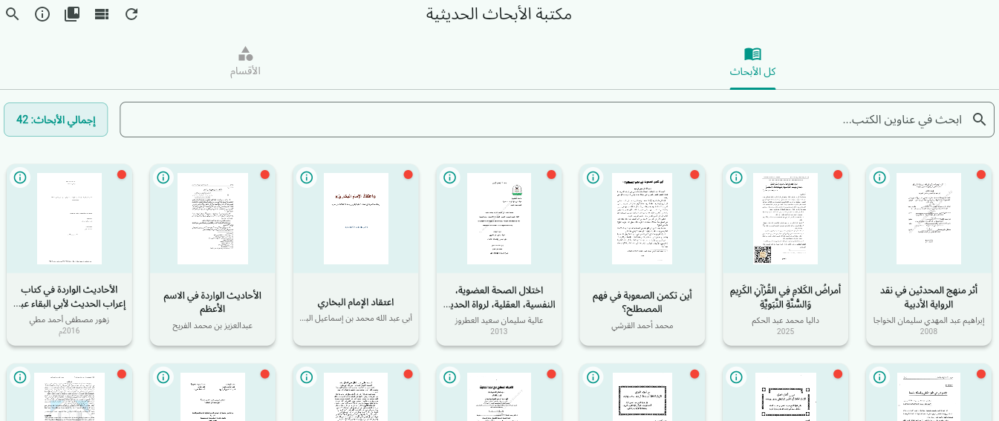
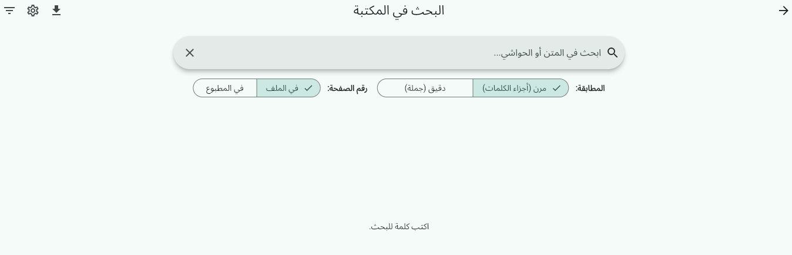
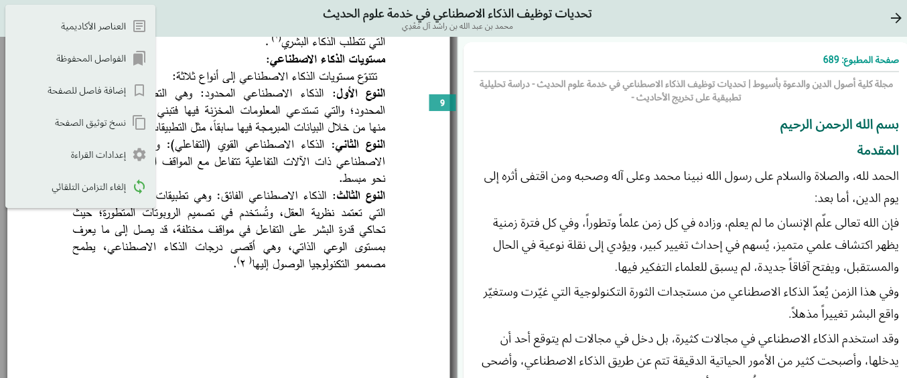
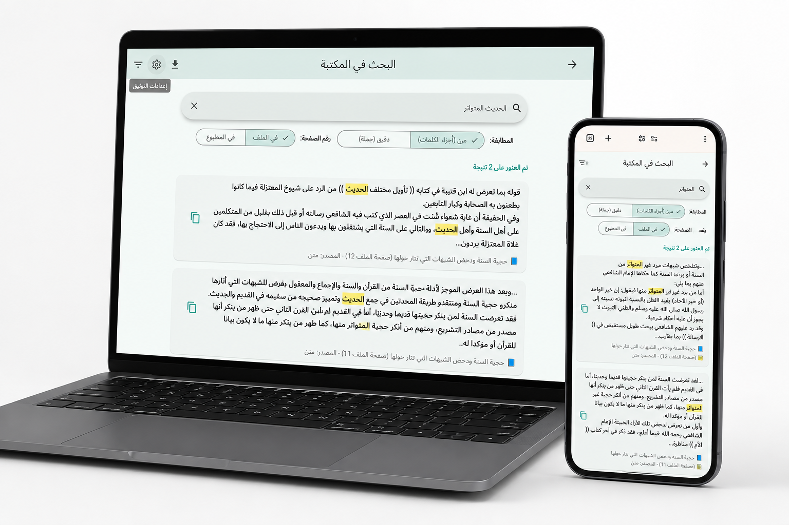

[English Version Below ⬇️](#english-version)

  <!-- [أدخل صورة البانر المتحرك أو الشعار هنا] -->
  

  # 🕌 مكتبة الأبحاث الحديثية الذكية (SaaS)
  
  **منصة أكاديمية سحابية متقدمة، تجمع بين المعرفة الشرعية العميقة والهندسة البرمجية المتطورة.**

  <!-- التقنيات المستخدمة -->
  

    
    
    
  

  [تجربة النسخة الحية](https://hadithresearchlibrary.pages.dev/) • [موقعي الشخصي]([أدخل رابط الموقع الشخصي هنا])

---

## 📖 عن المشروع

**مكتبة الأبحاث الحديثية الذكية** هي منصة سحابية متكاملة صُممت بعناية فائقة لتخدم الباحثين الشرعيين، الأكاديميين، والمؤسسات العلمية.

عادةً ما يتطلب البحث الحديثي التنقل بين آلاف المخطوطات والكتب المطبوعة، وهي عملية تستغرق وقتاً طويلاً وعرضة للخطأ. يحل هذا المشروع هذه المشكلة الجذرية من خلال رقمنة وهيكلة كميات ضخمة من الأبحاث الحديثية، مع توفير محرك بحث نصي فائق السرعة، ومزامنة لحظية تربط نتائج البحث بمصورات المخطوطات والكتب الأصلية.

تم بناء المنصة مع التركيز على الأداء العالي، القابلية للتوسع، وتجربة المستخدم الاستثنائية، مما يبرز القدرة على التعامل مع هياكل البيانات المعقدة مع الحفاظ على واجهة تفاعلية سلسة وأنيقة.

## ✨ المميزات الرئيسية

*   🚀 **بحث نصي متقدم وفائق السرعة:** استعلامات لحظية عبر آلاف الوثائق والأبحاث الحديثية المهيكلة بدقة.
    *   **
*   🔄 **مزامنة لحظية للمخطوطات:** عرض متزامن حيث يؤدي التنقل في النص الرقمي إلى الانتقال التلقائي لنفس الموضع في صورة المخطوطة أو الكتاب الأصلي.
    *   **
*   📱 **واجهة تفاعلية متعددة المنصات:** تجربة مستخدم موحدة وسلسة عبر الويب، سطح المكتب، والهواتف المحمولة، اعتماداً على قوة إطار عمل Flutter.
    *   **
*   ⚡ **خادم خلفي عالي الأداء:** مبني باستخدام FastAPI لضمان معالجة متزامنة وسريعة للبيانات المعقدة بكفاءة عالية.

## 🏗️ المعمارية التقنية

تعتمد المنصة على معمارية حديثة (Microservices-oriented) لضمان القابلية للتوسع وسهولة الصيانة:

*   **الواجهة الأمامية (Flutter):** تم اختياره لقدرته الفائقة على تقديم أداء يضاهي التطبيقات الأصيلة (Native)، مع واجهات تفاعلية مخصصة تعمل على الويب والموبايل من كود برمجي واحد.
*   **الخادم (FastAPI):** تم اعتماده لسرعته المذهلة، ودعمه الأصيل للبرمجة غير المتزامنة (ASGI)، مما يجعله الخيار الأمثل لواجهات برمجة التطبيقات (APIs) الكثيفة البيانات.
*   **قواعد البيانات ومحرك البحث:** [أدخل اسم قاعدة البيانات/محرك البحث، مثل PostgreSQL أو Elasticsearch] لإدارة البحث المتقدم في النصوص العربية المهيكلة.

  <!-- [أدخل صورة الرسم البياني للمعمارية التقنية هنا] -->
  

## 🔒 ملاحظة حول الكود المصدري (مستودع عرض فقط)

> **ملاحظة لمدراء التوظيف والمدراء التقنيين (CTOs):**
> هذا المستودع مخصص كـ **واجهة عرض (Showcase)** لتوضيح المعمارية التقنية، تصميم واجهات المستخدم (UI/UX)، والمميزات البرمجية للمشروع.
> 
> نظراً لحقوق الملكية الفكرية (IP) والتراخيص التجارية، فإن الكود المصدري الفعلي محفوظ في **مستودع مغلق (Private)**. يسعدني جداً مناقشة تفاصيل التنفيذ البرمجي، تصميم النظام، وأفضل الممارسات المتبعة في كتابة الكود خلال المقابلات التقنية.
> 
> 🔗 **[اضغط هنا لتجربة النسخة الحية](https://hadithresearchlibrary.pages.dev/)**
> 🔗 **[زيارة موقعي الشخصي ومعرض أعمالي]([أدخل رابط الموقع الشخصي هنا])**

## 📫 التواصل

أرحب دائماً بمناقشة الفرص الوظيفية التقنية، التعاون الأكاديمي، أو الفرص الاستثمارية.

*   💼 **لينكد إن:** [أدخل رابط حساب لينكد إن هنا]
*   📧 **البريد الإلكتروني:** [أدخل البريد الإلكتروني هنا]
*   🌐 **الموقع الشخصي:** [أدخل رابط الموقع الشخصي هنا]

---
 

<h1 id="english-version" align="left">English Version</h1>

  <!-- [Placeholder for Animated Banner or Logo] -->
  

  # 🕌 Smart Hadith Research Library (SaaS)
  
  **An Advanced Cloud-Based Academic Platform Bridging Deep Islamic Sciences with State-of-the-Art Software Engineering.**

  <!-- Badges -->
  

    
    
    
  

  [Live Demo](https://hadithresearchlibrary.pages.dev/) • [Personal Portfolio]([Insert Portfolio Link Here])

---

## 📖 About The Project

The **Smart Hadith Research Library** is a comprehensive SaaS platform meticulously engineered to serve Islamic scholars, researchers, and academic institutions. 

Traditional Hadith research often involves navigating through thousands of structured manuscripts and text volumes—a time-consuming and error-prone process. This project solves this fundamental problem by digitizing and structuring massive volumes of Hadith research, pairing it with lightning-fast text search capabilities, and instantly synchronizing search results with high-resolution scans of the original manuscripts.

It is built with performance, scalability, and exceptional user experience in mind, demonstrating the ability to handle complex data structures while maintaining an elegant and responsive user interface.

## ✨ Key Features

*   🚀 **Ultra-Fast Advanced Text Search:** Sub-second querying across thousands of highly structured Hadith documents and research papers.
    *   **
*   🔄 **Real-Time Manuscript Synchronization:** Side-by-side view where navigating the digital text instantly syncs with the exact location in the original scanned manuscript or book.
    *   **
*   📱 **Cross-Platform Accessibility:** A seamless, responsive experience across Web, Desktop, and Mobile, leveraging Flutter's unified codebase.
    *   **
*   ⚡ **High-Performance Backend:** Powered by FastAPI for asynchronous, highly concurrent API endpoints capable of processing complex queries efficiently.

## 🏗️ Technical Architecture

This platform utilizes a modern, decoupled microservices-oriented architecture to ensure scalability and maintainability:

*   **Frontend (Flutter):** Chosen for its unparalleled ability to deliver native-like performance and highly customized, interactive UI components across web and mobile platforms from a single codebase.
*   **Backend (FastAPI):** Selected for its incredible speed, native asynchronous support (ASGI), and automatic OpenAPI documentation, making it the perfect choice for our data-intensive APIs.
*   **Database & Search Engine:** [Insert your DB/Search Engine, e.g., PostgreSQL / Elasticsearch / Meilisearch] used to handle full-text search across heavily structured Arabic text.

  <!-- [Placeholder for Architecture Diagram] -->
  

## 🔒 Source Code Notice (Showcase Repository)

> **Note to Recruiters and Engineering Managers:**
> This repository serves as a **Showcase / Presentation** of the project's architecture, UI/UX, and technical capabilities. 
> 
> Due to Intellectual Property (IP) protection and commercial licensing, the actual source code resides in a **private repository**. I am more than happy to discuss the technical implementation details, system design, and coding practices during an interview.
> 
> 🔗 **[Click here to try the Live Demo](https://hadithresearchlibrary.pages.dev/)**
> 🔗 **[Visit my Personal Portfolio]([Insert Portfolio Link Here])**

## 📫 Contact & Connect

I am actively open to discussions regarding technical roles, collaborations, or investment opportunities.

*   💼 **LinkedIn:** [Insert LinkedIn Profile URL Here]
*   📧 **Email:** [Insert Email Address Here]
*   🌐 **Website:** [Insert Portfolio URL Here]

